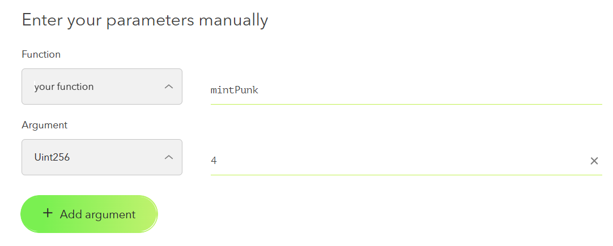
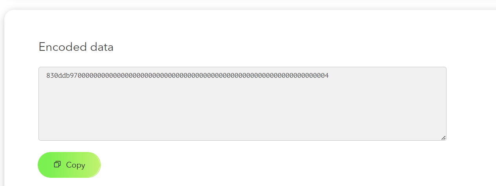
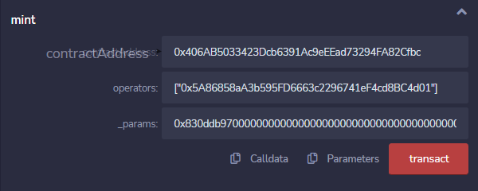
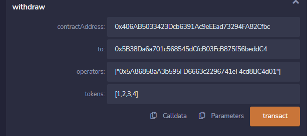

# ProxyMint Hardhat

**Код контрактов -** https://github.com/typicalHuman/ProxyMintHH/tree/master/contracts/proxy

## Архитектура

2 контракта:

1. **ProxyMinter** - главный контракт, его деплоим 1 раз

2. **ProxyOperator** - вспомогательный контракт для минтов, **его деплоим столько - сколько раз нам нужно вызвать функцию минта**.

## Гайд

1. Деплоим контракт **ProxyMinter**

2. Деплоим контракты **ProxyOperator** и передаем ему в качестве аргумента конструктора - адрес задеплоенного контракта ProxyMinter

3. Для минта вводим следующие параметры:
   
   1. **contractAddress** - адрес NFT контракта
   
   2. **operators** - массив операторов. Чтобы облегчить задачу - можно вызвать скрипт *operatorsParser.py* (python operatorsParser.py), предварительно создав файл *operators.txt* с адресами наших контрактов операторов.
   
   3. **_params** - вызываемый байткод минта на контракте нфт. Чтобы его получить переходим по ссылке - https://abi.hashex.org/ . Здесь в поле Function выбираем yourFunction и устанавливаем ее значение. Затем добавляем аргументы с помощью кнопки Add argument, устанавливая их тип и значение. и по итогу получаем что-то подобное:
      
      
      
      
      
      **Encoded data вводим, добавляя 0x в начале.**

По итогу получаем примерно следующие данные:

*+если минт не бесплатный передаем суммарное количество эфира: если минт 1 нфт стоит 0.1, а нам надо сминтить 10 и на контракте ограничение на максимум 2 нфт для 1 кошелька, то value должен быть 0.1, а количество контрактов операторов - 5.*

4. Для withdraw вводим следующие параметры:
   
   1. **contractAddress** - адрес NFT контракта
   
   2. **to** - адрес куда переслать все нфтшки
   
   3. **operators** - массив операторов. Чтобы облегчить задачу - можно вызвать скрипт *operatorsParser.py* (python operatorsParser.py), предварительно создав файл *operators.txt* с адресами наших контрактов операторов.
   
   4. **tokens** - массив id токенов, которые были сминчены. Их можно получить следующим образом: берем хеш транзы, в которой были сминчены нфт и вызываем скрипт *logsParser.py* с параметром хеша в кавычках, к примеру: py logsParser.py "0x22c14a0a1358c85277a144781510e96065af5d9e1fa4b2618956f70ce49dada4"
   
   

---

## НФТ контракты на которых велись тесты минтов:

- BasePunks
- BoreBonez
- DegentlemansClub
- Gorgonzorats
- Nakamigas
- OniForce
- PumpingSlimes
- SmartClubNFT

